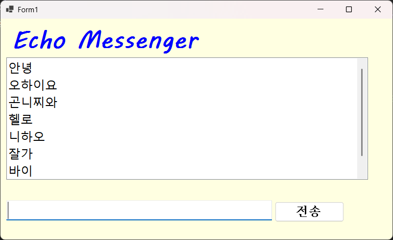
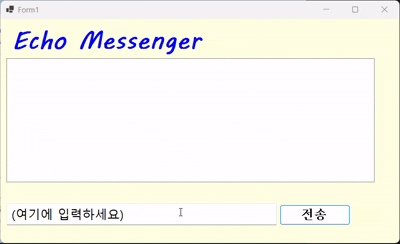
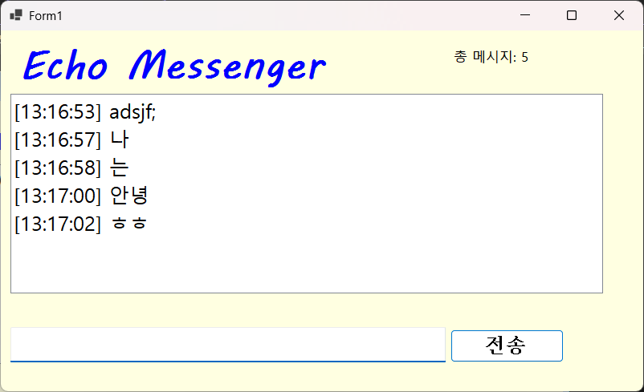

 # (C# 코딩) 에코메신저
 
 ## 개요
 -C# 프로그래밍 학습
 -1줄 소개: 사용자 키보드 입력을 받아서 처리하는 프로그램
 -사용한 플랫폼: -C#, .NET Windows Forms, Visual Studio, GitHub
 -사용한 컨트롤:
  -Label, TextBox, ListBox, Button
 -사용한 기술과 구현한 기능:
  -Visual Studio를 이용하여 UI 디자인
  
  ## 실행 화면(과제1)
   
  
  -과제내용
   -Label(표시), TextBox(입력), Button(전송), ListBox(대화창)를 적절히 배치
   -전송 버튼 클릭 시 TextBox의 텍스트를 ListBox의 Items로 추가
   -추가 직후 TextBox의 내용을 비워 다음 입력을 준비
   
  -구현 내용과 기능 설명
   -입력창에 메시지 입력하고 전송 버튼을 누르면 메시지가 리스트 박스에 표시
   -계속 반복하면 메시지가 리스트 박스에 한줄씩 계속 추가
   -추가 내용이 많아지면 리스트 박스에 스크롤바가 자동으로 생기고 스크롤됨

 ## 실행화면(과제2)
 

 -과제내용
  -사용자 ui 개선
  -입력창의 기존 메시지 지우기
  - 입력창에 입력 포코스 갖다 놓기
  - 엔터키로 메시지 전송 기능 추가
  - 공백 메시지 입력 방지 기능 추가

 -구현 내용과 기능 설명
  - 입력창의 기존 텍스트를 지우고, 포커스를 입력창으로 이동하여 사용자가 바로 다음 메시지를 입력할 수 있도록 개선
  - 엔터키로 메시지 전송 기능 추가하여 사용자의 편의성 향상
  - 공백 메시지 입력 방지 기능 추가하여 불필요한 메시지 전송 방지

 ## 실행화면(과제3)
 

 -과제내용
  - 데이터 가공 및 상태 표시 기능 추가
  -타임스탬프 기능 추가
  -메시지 수 카운트 기능 추가
  -불필요한 공백을 제거하는 기능 추가

 -구현 내용과 기능 설명
  -각 메시지에 타임스탬프를 추가하여 메시지가 언제 전송되었는지 표시
  -메시지 수 카운트 기능을 추가하여 현재까지 전송된 메시지의 총 수를 표시
  -입력된 메시지에서 불필요한 공백을 제거하여 깔끔한 메시지 표시